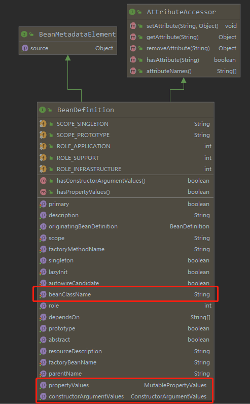

# Spring bean的生命周期

在Spring框架中，bean是一个核心概念，


## 1. Bean如何被加载

bean通过各种reader（xml、Properties或Scanner）从文件或者class文件中读取bean的定义。bean的定义使用BeanDefinition接口描述，代码中通常使用GenericBeanDefinition实现类，所有bean的定义将被保存在`DefaultListableBeanFactory.beanDefinitionMap`中。


> 虽然ApplicationContext都实现了BeanFactory接口，但是在内部都是借助BeanFactory的实现类（例如：`DefaultListableBeanFactory`）完成bean的管理




BeanDefinition中最重要的三个信息

1. beanClassName
2. propertyValues
3. constructorArgumentValues


## 2. bean如何被实例化


### 2. 1 bean实例化的过程


一、获取RootBeanDefinition对象

1. 获取beanName对应的BeanDefinition
2. 获取当前BeanDefinition的parentBeanName，如果存在，将该BeanDefinition作为父级。否者从父级beanFactory中获取beanName对应的BeanDefinition作为父级
3. merge两个BeanDefinition时，父级的优先级小。


二、通过`org.springframework.beans.factory.config.InstantiationAwareBeanPostProcessor#postProcessBeforeInstantiation`处理，如果获得bean对象，将直接返回

```java
		Object bean = null;
		if (!Boolean.FALSE.equals(mbd.beforeInstantiationResolved)) {
			// Make sure bean class is actually resolved at this point.
			if (!mbd.isSynthetic() && hasInstantiationAwareBeanPostProcessors()) {
				Class<?> targetType = determineTargetType(beanName, mbd);
				if (targetType != null) {
					bean = applyBeanPostProcessorsBeforeInstantiation(targetType, beanName);
					if (bean != null) {
						bean = applyBeanPostProcessorsAfterInitialization(bean, beanName);
					}
				}
			}
			mbd.beforeInstantiationResolved = (bean != null);
		}
		return bean;
```


三、实例化bean对象，这里是仅通过构造函数创建对象，未做其他任何操作


四、`org.springframework.beans.factory.support.MergedBeanDefinitionPostProcessor#postProcessMergedBeanDefinition`方法处理RootBeanDefinition对象。**每个RootBeanDefinition仅会被处理一次**

```java
	protected void applyMergedBeanDefinitionPostProcessors(RootBeanDefinition mbd, Class<?> beanType, String beanName) {
		for (BeanPostProcessor bp : getBeanPostProcessors()) {
			if (bp instanceof MergedBeanDefinitionPostProcessor) {
				MergedBeanDefinitionPostProcessor bdp = (MergedBeanDefinitionPostProcessor) bp;
				bdp.postProcessMergedBeanDefinition(mbd, beanType, beanName);
			}
		}
	}
```


五、`org.springframework.beans.factory.config.InstantiationAwareBeanPostProcessor#postProcessAfterInstantiation`方法处理实例后的bean对象。该方法返回false，表示bean对象处理完成，可以直接被使用。此时对该bean对象将不会做后面的处理

```java
boolean continueWithPropertyPopulation = true;

if (!mbd.isSynthetic() && hasInstantiationAwareBeanPostProcessors()) {
   for (BeanPostProcessor bp : getBeanPostProcessors()) {
      if (bp instanceof InstantiationAwareBeanPostProcessor) {
         InstantiationAwareBeanPostProcessor ibp = (InstantiationAwareBeanPostProcessor) bp;
         if (!ibp.postProcessAfterInstantiation(bw.getWrappedInstance(), beanName)) {
            continueWithPropertyPopulation = false;
            break;
         }
      }
   }
}

if (!continueWithPropertyPopulation) {
   return;
}
```


六、根据属性的名称或类型创建PropertyValue对象，为后面给bean对象注入属性使用。

```java
		PropertyValues pvs = (mbd.hasPropertyValues() ? mbd.getPropertyValues() : null);

		if (mbd.getResolvedAutowireMode() == RootBeanDefinition.AUTOWIRE_BY_NAME ||
				mbd.getResolvedAutowireMode() == RootBeanDefinition.AUTOWIRE_BY_TYPE) {
			MutablePropertyValues newPvs = new MutablePropertyValues(pvs);

			// Add property values based on autowire by name if applicable.
			if (mbd.getResolvedAutowireMode() == RootBeanDefinition.AUTOWIRE_BY_NAME) {
				autowireByName(beanName, mbd, bw, newPvs);
			}

			// Add property values based on autowire by type if applicable.
			if (mbd.getResolvedAutowireMode() == RootBeanDefinition.AUTOWIRE_BY_TYPE) {
				autowireByType(beanName, mbd, bw, newPvs);
			}

			pvs = newPvs;
		}
```


七、使用`org.springframework.beans.factory.config.InstantiationAwareBeanPostProcessor#postProcessPropertyValues`处理PropertyValues对象

```java
			PropertyDescriptor[] filteredPds = filterPropertyDescriptorsForDependencyCheck(bw, mbd.allowCaching);
			if (hasInstAwareBpps) {
				for (BeanPostProcessor bp : getBeanPostProcessors()) {
					if (bp instanceof InstantiationAwareBeanPostProcessor) {
						InstantiationAwareBeanPostProcessor ibp = (InstantiationAwareBeanPostProcessor) bp;
						pvs = ibp.postProcessPropertyValues(pvs, filteredPds, bw.getWrappedInstance(), beanName);
						if (pvs == null) {
							return;
						}
					}
				}
			}
```


八、通过PropertyValue对bean对象的属性进行赋值。并对象的赋值中涉及非常复杂的对象转换，以后再详解。

```
		if (pvs != null) {
			applyPropertyValues(beanName, mbd, bw, pvs);
		}
```


九、调用bean类型中存在的Aware方法

```java
		if (bean instanceof Aware) {
			if (bean instanceof BeanNameAware) {
				((BeanNameAware) bean).setBeanName(beanName);
			}
			if (bean instanceof BeanClassLoaderAware) {
				ClassLoader bcl = getBeanClassLoader();
				if (bcl != null) {
					((BeanClassLoaderAware) bean).setBeanClassLoader(bcl);
				}
			}
			if (bean instanceof BeanFactoryAware) {
				((BeanFactoryAware) bean).setBeanFactory(AbstractAutowireCapableBeanFactory.this);
			}
		}
```


十、执行`org.springframework.beans.factory.config.BeanPostProcessor#postProcessBeforeInitialization`处理bean对象，此时bean对象可以被替换。

```
		Object result = existingBean;
		for (BeanPostProcessor beanProcessor : getBeanPostProcessors()) {
			Object current = beanProcessor.postProcessBeforeInitialization(result, beanName);
			if (current == null) {
				return result;
			}
			result = current;
		}
		return result;
```


十一、执行afterPropertiesSet方法和用户自定义的Init方法

```java
// 代码有删减
((InitializingBean) bean).afterPropertiesSet();

invokeCustomInitMethod(beanName, bean, mbd);
```


十二、执行`org.springframework.beans.factory.config.BeanPostProcessor#postProcessAfterInitialization`处理bean对象，此时bean也可以被替换

```
		Object result = existingBean;
		for (BeanPostProcessor beanProcessor : getBeanPostProcessors()) {
			Object current = beanProcessor.postProcessAfterInitialization(result, beanName);
			if (current == null) {
				return result;
			}
			result = current;
		}
		return result;
```


### 2.2 循环依赖的解决

1. 通过`singletonObjects`属性保存已经创建好的单例模式bean，下次获取可以直接使用。
2. 通过`singletonFactories`属性保存创建未初始化bean的工厂。
3. 通过`earlySingletonObjects`保存已创建的未初始化bean的引用。


在bean对象刚刚被实例化出来时（上面的第四和第五步之间），会将一个工厂函数放入`singletonFactories`中。该工厂函数引用下面的`getEarlyBeanReference`获取未初始化的bean对象，其中**参数bean就是刚刚被实例化的bean对象**。

通过`org.springframework.beans.factory.config.SmartInstantiationAwareBeanPostProcessor#getEarlyBeanReference`创建bean的引用，用于解决循环依赖。**该方法返回的bean对象可能与原bean对象不相同**

```java
protected Object getEarlyBeanReference(String beanName, RootBeanDefinition mbd, Object bean) {
   Object exposedObject = bean;
   if (!mbd.isSynthetic() && hasInstantiationAwareBeanPostProcessors()) {
      for (BeanPostProcessor bp : getBeanPostProcessors()) {
         if (bp instanceof SmartInstantiationAwareBeanPostProcessor) {
            SmartInstantiationAwareBeanPostProcessor ibp = (SmartInstantiationAwareBeanPostProcessor) bp;
            exposedObject = ibp.getEarlyBeanReference(exposedObject, beanName);
         }
      }
   }
   return exposedObject;
}
```


在bean初始化完成后，会检查未被初始化的bean对象是否被使用。如果被使用，而且BeanPostProcessor没有改变bean对象，最终将返回未初始化就被使用的原bean对象，这样可以确保当前的bean对象与被引用的bean对象是相同的。

```java
	// 代码经过删减，只适合看流程
	protected Object doCreateBean(final String beanName, final RootBeanDefinition mbd, final @Nullable Object[] args)
			throws BeanCreationException {

		final Object bean = instanceWrapper.getWrappedInstance(); // 获得刚刚被创建的bean对象

		// Allow post-processors to modify the merged bean definition.
		synchronized (mbd.postProcessingLock) {
			applyMergedBeanDefinitionPostProcessors(mbd, beanType, beanName);
		}

		if (earlySingletonExposure) {
            // 创建一个工厂，提供未初始化的bean对象，用于解决循环依赖
			addSingletonFactory(beanName, () -> getEarlyBeanReference(beanName, mbd, bean));
		}

		// Initialize the bean instance.
		Object exposedObject = bean;
		try {
			populateBean(beanName, mbd, instanceWrapper);
            // 初始化bean对象，由于BeanPostProcessor可以更换bean对象，因此exposedObject可能不是原bean对象
			exposedObject = initializeBean(beanName, exposedObject, mbd);
		}
		catch (Throwable ex) {
		}

		if (earlySingletonExposure) {
			Object earlySingletonReference = getSingleton(beanName, false);
            // earlySingletonReference不为null，说明未初始化的bean已经被使用了
			if (earlySingletonReference != null) {
				if (exposedObject == bean) { // exposedObject == bean，说明BeanPostProcessor没有改变bean对象，此时将返回未初始化就被使用的原bean对象。
					exposedObject = earlySingletonReference;
				}
			}
		}
		return exposedObject;
	}
```


1. 


